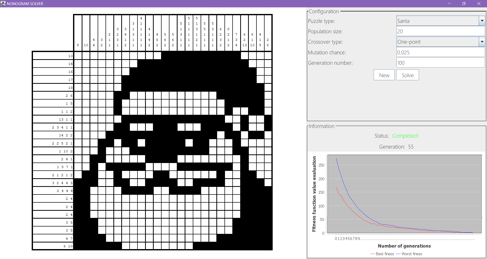

# Nonogram Solver using Genetic Algorithm in Java
## Overview
This repository contains a Java implementation of a Nonogram Solver using Genetic Algorithm.
The project was developed as part of the Artificial Intelligence Fundamentals course at Nong Lam University.
## What is a Nonogram?
[A Nonogram](https://en.wikipedia.org/wiki/Nonogram), also known as Picross or Griddlers, is a logic puzzle that involves filling in cells in a grid to reveal a hidden picture. The numbers 
## How it Works
The solver uses a Genetic Algorithm to evolve a population of possible solutions iteratively. Each solution is represented as a chromosome, and the algorithm utilizes genetic operators such as crossover and mutation to improve the solutions over generations.


## Getting Started

Follow these steps to run the Nonogram Solver on your machine:

1.Clone the repository:

```sh
git clone https://github.com/million-dollar-dev/nlu-ai-project
```

2.Search and run class StartApp.java
## Author
This project was developed as part of the Artificial Intelligence Fundamentals course at Nong Lam University, Ho Chi Minh City:
- [Dang Cao Hoang Tuan](https://github.com/million-dollar-dev)
- [Nguyen Thi Thuy Thuy]()

## Image


## Acknowledgments

Special thanks to the contributors and anyone interested in improving this Nonogram Solver.
Feel free to reach out for any inquiries or collaboration.

### _Happy Nonogram Solving!_